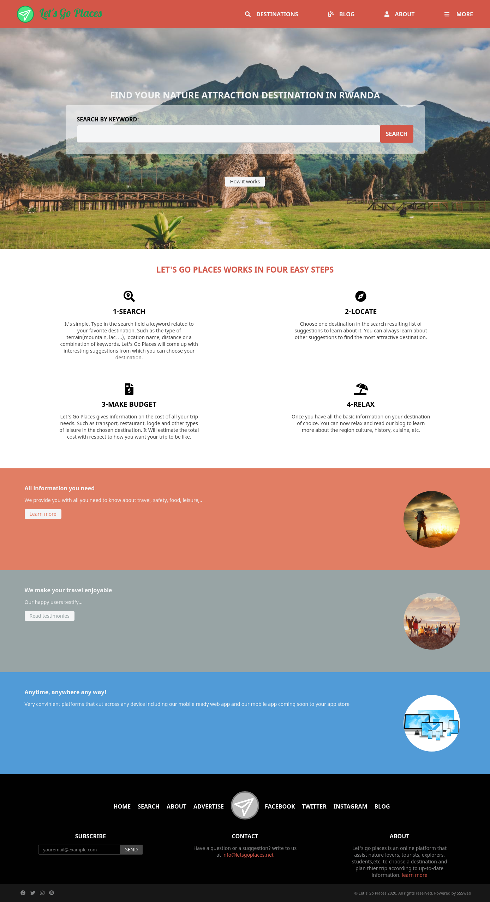

# LetsGoPlaces

This project is about creating a directory of nature attraction destination for nature lovers.
User can search for a place they want to visit and get more information. If they have not made up their mind yet,
they can use keywords and get a lot of suggestions that will help them choose.

## Screenshot

## Built With

- HTML
- CSS
- SASS
- Fontawesome
  ​

## Live Demo

​
[Live Demo Link](https://raw.githack.com/mugberto/LetsGoPlaces/building-letsgoplaces-pages/index.html)
​

## Getting Started

​
**Clone the repo on your system, find the index.html file and open with your browser**
​

## Author
​
#### 👤 **Hubert MUGABO**
​
- Github: [@mugberto](https://github.com/mugberto)
- Twitter: [@mugberto](https://twitter.com/mugberto)
- Linkedin: [mugberto](https://www.linkedin.com/in/hubert-mugabo-23144b6a/)

 ​
## Contributing

Contributions, issues and feature requests are welcome!
​
Feel free to check the [issues page](https://github.com/mugberto/LetsGoPlaces/issues).
​

## Show your support

Please, give a ⭐️ if you like this project!
​

## Acknowledgments

- Mathew Njuguna and others on Behance
- Our Stand up teams
- Microverse TSE

  ​
## License
​
This project is [MIT](lic.url) licensed.